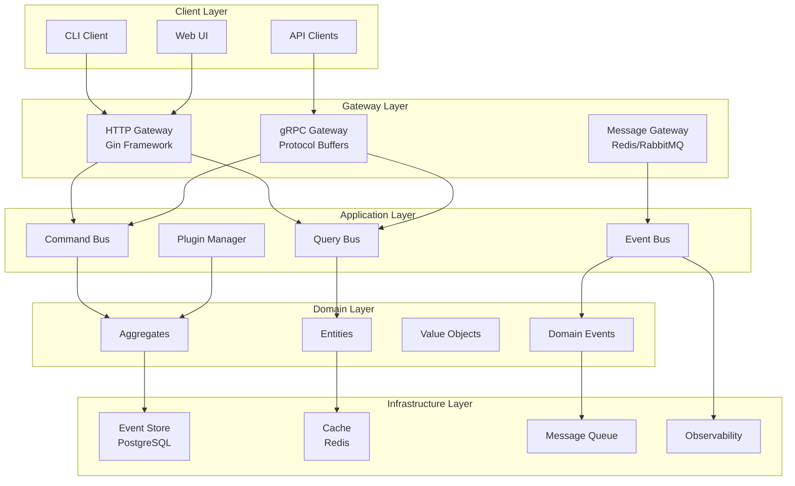

# FlexCore Architecture Overview

FlexCore is designed as a high-performance, distributed system core engine that combines the best of Go's performance with Python's flexibility. This document provides a comprehensive overview of the architectural decisions, patterns, and principles that make FlexCore a robust foundation for enterprise applications.

## 🏗️ Architectural Principles

### 1. Clean Architecture

FlexCore follows Uncle Bob's Clean Architecture, organizing code into concentric layers with dependencies pointing inward:

```
┌─────────────────────────────────────────────────────────┐
│                    External Interfaces                  │
│              (HTTP, gRPC, Message Queues)              │
└─────────────────────────────────────────────────────────┘
                            ↓
┌─────────────────────────────────────────────────────────┐
│                 Interface Adapters                      │
│         (Controllers, Presenters, Gateways)            │
└─────────────────────────────────────────────────────────┘
                            ↓
┌─────────────────────────────────────────────────────────┐
│                 Application Business Rules               │
│          (Command Handlers, Query Handlers)            │
└─────────────────────────────────────────────────────────┘
                            ↓
┌─────────────────────────────────────────────────────────┐
│                Enterprise Business Rules                │
│              (Entities, Domain Services)               │
└─────────────────────────────────────────────────────────┘
```

### 2. Domain-Driven Design (DDD)

- **Bounded Contexts**: Clear boundaries between different business domains
- **Aggregates**: Consistency boundaries for business transactions
- **Domain Events**: First-class representation of business events
- **Ubiquitous Language**: Shared vocabulary between developers and domain experts

### 3. CQRS + Event Sourcing

- **Command Query Responsibility Segregation**: Separate read and write models
- **Event Store**: Immutable log of all business events
- **Event Replay**: Reconstruct state from events for debugging and analytics
- **Eventual Consistency**: Asynchronous propagation of state changes

### 4. Hybrid Language Architecture

- **Go Core**: High-performance, concurrent processing engine
- **Python Integration**: Flexible business logic and rapid development
- **Seamless Interop**: Type-safe communication between Go and Python layers

## 🎯 System Architecture

### High-Level System View



### Core Components

#### 1. Command Bus

**Purpose**: Routes and executes commands that change system state

```go
type CommandBus interface {
    Send(ctx context.Context, cmd Command) error
    RegisterHandler(cmdType string, handler CommandHandler)
}

type CommandHandler interface {
    Handle(ctx context.Context, cmd Command) error
}
```

**Features**:

- Type-safe command routing
- Middleware support for cross-cutting concerns
- Async command execution
- Command validation and authorization

#### 2. Query Bus

**Purpose**: Processes queries for reading data

```go
type QueryBus interface {
    Ask(ctx context.Context, query Query) (interface{}, error)
    RegisterHandler(queryType string, handler QueryHandler)
}

type QueryHandler interface {
    Handle(ctx context.Context, query Query) (interface{}, error)
}
```

**Features**:

- Optimized read models
- Caching support
- Pagination and filtering
- Multiple data source aggregation

#### 3. Event Store

**Purpose**: Persists domain events with full audit trail

```go
type EventStore interface {
    AppendEvents(ctx context.Context, streamID string, events []Event) error
    ReadEvents(ctx context.Context, streamID string, fromVersion int) ([]Event, error)
    ReadAllEvents(ctx context.Context, fromPosition int64) ([]Event, error)
}
```

**Features**:

- Immutable event log
- Stream-based organization
- Snapshotting for performance
- Event replay capabilities

#### 4. Plugin System

**Purpose**: Hot-swappable functionality with dynamic loading

```go
type Plugin interface {
    Name() string
    Version() string
    Initialize(config Config) error
    Process(ctx context.Context, data interface{}) (interface{}, error)
    Shutdown() error
}
```

**Features**:

- Runtime plugin loading
- Plugin dependency management
- Plugin lifecycle management
- Resource isolation

### Data Flow Patterns

#### Command Flow (Write Operations)

1. **Client Request** → HTTP/gRPC endpoint receives command
2. **Validation** → Command structure and business rules validated
3. **Authorization** → User permissions checked
4. **Domain Logic** → Aggregate processes command and generates events
5. **Event Storage** → Events persisted to event store
6. **Event Publishing** → Events published to message bus
7. **Response** → Success/failure response sent to client

#### Query Flow (Read Operations)

1. **Client Request** → HTTP/gRPC endpoint receives query
2. **Authorization** → Read permissions checked
3. **Cache Check** → Check if data available in cache
4. **Data Retrieval** → Fetch from read model or aggregate state
5. **Response Formatting** → Transform data for client consumption
6. **Caching** → Store result in cache for future requests

#### Event Flow (Async Processing)

1. **Event Generation** → Domain operations generate events
2. **Event Storage** → Events persisted in event store
3. **Event Publishing** → Events sent to message bus
4. **Event Handling** → Subscribers process events asynchronously
5. **Side Effects** → External integrations, notifications, etc.
6. **Read Model Updates** → Query models updated with new state

## 🔄 Go-Python Integration

### Architecture Bridge

```go
// Go side - C bindings for Python integration
package python

/*
#cgo pkg-config: python3-embed
#include <Python.h>
*/
import "C"

type PythonBridge struct {
    interpreter *C.PyObject
    modules     map[string]*C.PyObject
}

func (b *PythonBridge) CallHandler(module, function string, args interface{}) (interface{}, error) {
    // Convert Go types to Python objects
    // Call Python function
    // Convert result back to Go types
}
```

```python
# Python side - Event handler registration
from flexcore import FlexCore

@FlexCore.event_handler("user.created")
def handle_user_created(event):
    # Process user creation event
    send_welcome_email(event.data.email)
    update_analytics(event.data)

@FlexCore.command_handler("create_user")
def create_user_command(cmd):
    # Validate command
    if not cmd.email:
        raise ValidationError("Email required")

    # Return domain event
    return UserCreatedEvent(
        user_id=generate_id(),
        email=cmd.email,
        created_at=datetime.utcnow()
    )
```

### Integration Patterns

#### 1. Event-Driven Integration

- Go publishes domain events
- Python subscribes to relevant events
- Type-safe event marshaling/unmarshaling
- Async processing with proper error handling

#### 2. Command Delegation

- HTTP endpoints in Go delegate to Python handlers
- Python returns domain events or results
- Go persists events and manages transactions
- Consistent error handling across languages

#### 3. Plugin Architecture

- Plugins can be written in Go or Python
- Unified plugin interface across languages
- Hot-swappable plugin loading
- Resource isolation and lifecycle management

## 🎭 Layered Architecture Details

### Domain Layer (Core Business Logic)

**Location**: `internal/domain/`

```go
// Aggregate Root
type User struct {
    id       UserID
    email    Email
    profile  UserProfile
    events   []DomainEvent
    version  int
}

func (u *User) ChangeEmail(newEmail Email) error {
    if u.email.Equals(newEmail) {
        return nil // No change needed
    }

    // Business validation
    if !newEmail.IsValid() {
        return ErrInvalidEmail
    }

    // Generate domain event
    event := UserEmailChangedEvent{
        UserID:   u.id,
        OldEmail: u.email,
        NewEmail: newEmail,
        OccurredAt: time.Now(),
    }

    u.recordEvent(event)
    u.email = newEmail

    return nil
}
```

**Responsibilities**:

- Core business entities and value objects
- Business rule enforcement
- Domain event generation
- Aggregate boundary management

### Application Layer (Use Cases)

**Location**: `internal/app/`

```go
type CreateUserHandler struct {
    userRepo UserRepository
    eventBus EventBus
    logger   Logger
}

func (h *CreateUserHandler) Handle(ctx context.Context, cmd CreateUserCommand) error {
    // Validate command
    if err := cmd.Validate(); err != nil {
        return fmt.Errorf("invalid command: %w", err)
    }

    // Check business rules
    exists, err := h.userRepo.ExistsByEmail(ctx, cmd.Email)
    if err != nil {
        return fmt.Errorf("checking user existence: %w", err)
    }
    if exists {
        return ErrUserAlreadyExists
    }

    // Create domain object
    user := NewUser(cmd.Email, cmd.Profile)

    // Persist aggregate
    if err := h.userRepo.Save(ctx, user); err != nil {
        return fmt.Errorf("saving user: %w", err)
    }

    // Publish events
    for _, event := range user.UncommittedEvents() {
        if err := h.eventBus.Publish(ctx, event); err != nil {
            h.logger.Error("publishing event", "error", err, "event", event)
        }
    }

    return nil
}
```

**Responsibilities**:

- Use case orchestration
- Transaction management
- Event publishing
- Cross-cutting concerns (logging, metrics)

### Infrastructure Layer (External Concerns)

**Location**: `internal/infrastructure/`

```go
type PostgreSQLUserRepository struct {
    db     *sql.DB
    logger Logger
}

func (r *PostgreSQLUserRepository) Save(ctx context.Context, user *User) error {
    tx, err := r.db.BeginTx(ctx, nil)
    if err != nil {
        return fmt.Errorf("beginning transaction: %w", err)
    }
    defer tx.Rollback()

    // Save aggregate state
    query := `
        INSERT INTO users (id, email, profile, version)
        VALUES ($1, $2, $3, $4)
        ON CONFLICT (id) DO UPDATE SET
            email = EXCLUDED.email,
            profile = EXCLUDED.profile,
            version = EXCLUDED.version
        WHERE users.version = $5`

    _, err = tx.ExecContext(ctx, query,
        user.ID(), user.Email(), user.Profile(),
        user.Version(), user.Version()-1)
    if err != nil {
        return fmt.Errorf("saving user: %w", err)
    }

    // Save events
    for _, event := range user.UncommittedEvents() {
        if err := r.saveEvent(ctx, tx, event); err != nil {
            return fmt.Errorf("saving event: %w", err)
        }
    }

    return tx.Commit()
}
```

**Responsibilities**:

- Database persistence
- External API integration
- Message queue interaction
- File system operations

## 📊 Observability Architecture

### Metrics Collection

```go
type MetricsCollector struct {
    registry *prometheus.Registry
    counters map[string]prometheus.Counter
    gauges   map[string]prometheus.Gauge
}

func (m *MetricsCollector) IncrementCommandCount(cmdType string) {
    counter := m.counters[fmt.Sprintf("commands_total_%s", cmdType)]
    counter.Inc()
}
```

### Distributed Tracing

```go
func (h *CreateUserHandler) Handle(ctx context.Context, cmd CreateUserCommand) error {
    ctx, span := trace.StartSpan(ctx, "CreateUserHandler.Handle")
    defer span.End()

    span.SetAttributes(
        attribute.String("command.type", "CreateUser"),
        attribute.String("user.email", cmd.Email.String()),
    )

    // Handler implementation...
}
```

### Structured Logging

```go
type StructuredLogger struct {
    logger *zap.Logger
}

func (l *StructuredLogger) Info(msg string, fields ...zap.Field) {
    l.logger.Info(msg, fields...)
}

// Usage
logger.Info("User created",
    zap.String("user_id", user.ID().String()),
    zap.String("email", user.Email().String()),
    zap.Duration("duration", time.Since(start)),
)
```

## 🔐 Security Architecture

### Authentication & Authorization

- JWT tokens for stateless authentication
- RBAC (Role-Based Access Control) for authorization
- API rate limiting and throttling
- Input validation and sanitization

### Data Protection

- Encryption at rest and in transit
- Sensitive data masking in logs
- Audit logging for compliance
- GDPR compliance features

### Network Security

- TLS/SSL for all communications
- Network segmentation
- Firewall rules and security groups
- Regular security scanning

## 📈 Performance Characteristics

### Scalability Patterns

- **Horizontal Scaling**: Multiple instances behind load balancer
- **Database Sharding**: Partition data across multiple databases
- **Read Replicas**: Separate read and write databases
- **Caching Layers**: Multi-level caching strategy

### Performance Optimizations

- **Connection Pooling**: Reuse database connections
- **Batch Processing**: Group operations for efficiency
- **Async Processing**: Non-blocking event handling
- **Resource Pooling**: Reuse expensive resources

### Monitoring & Alerting

- Real-time performance metrics
- Automatic scaling based on load
- Proactive alerting on anomalies
- Performance trend analysis

## 🎯 Design Benefits

### 1. **Maintainability**

- Clear separation of concerns
- Testable architecture with dependency injection
- Consistent patterns across all layers
- Self-documenting code with domain language

### 2. **Scalability**

- Event-driven async processing
- Stateless service design
- Database and caching optimizations
- Microservices-ready architecture

### 3. **Flexibility**

- Plugin system for extensibility
- Multiple language support
- Configurable infrastructure backends
- API-first design for integration

### 4. **Reliability**

- Event sourcing for data consistency
- Comprehensive error handling
- Circuit breakers and retries
- Health checks and monitoring

### 5. **Developer Experience**

- Type safety across languages
- Rich development tooling
- Comprehensive testing framework
- Clear documentation and examples

---

This architecture provides a solid foundation that scales from simple applications to complex distributed systems while maintaining code quality, performance, and developer productivity.
