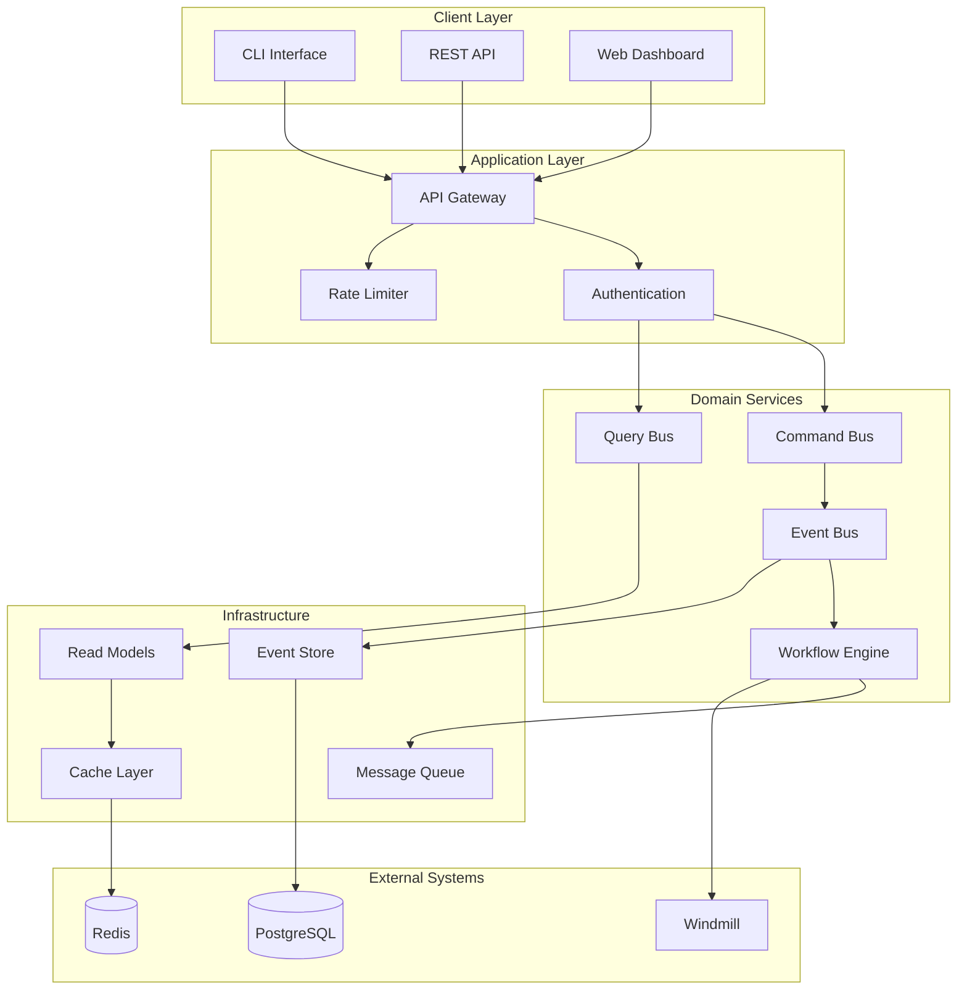
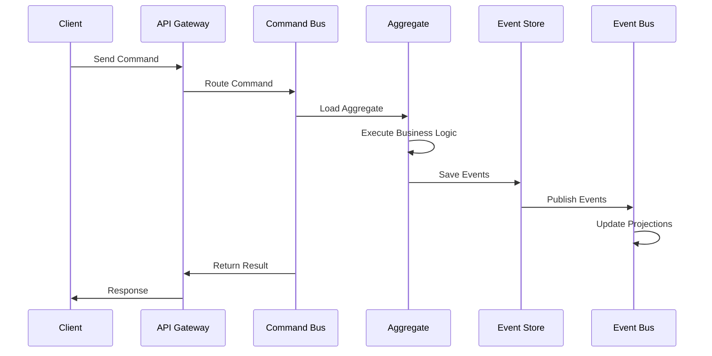
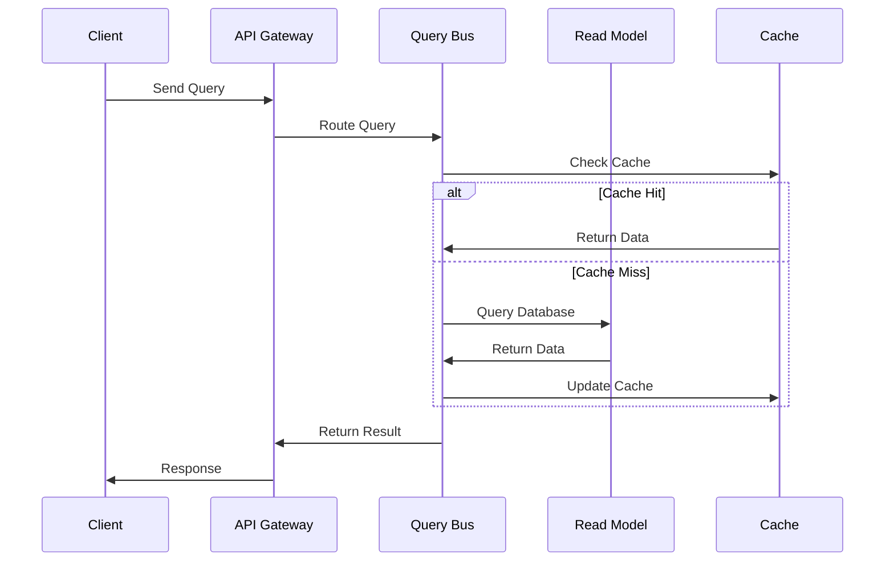

# FlexCore Architecture

## Overview

FlexCore is a distributed, event-driven architecture designed for enterprise-scale data processing and workflow orchestration. The system follows Clean Architecture principles with clear separation of concerns and dependency inversion.

## Architecture Principles

### 1. Domain-Driven Design (DDD)
- **Bounded Contexts**: Clear boundaries between different business domains
- **Aggregates**: Consistency boundaries for domain operations
- **Domain Events**: Communication mechanism between aggregates
- **Value Objects**: Immutable domain concepts

### 2. Event Sourcing
- **Event Store**: Immutable log of all domain events
- **Event Streams**: Ordered sequences of events per aggregate
- **Projections**: Read-optimized views derived from events
- **Snapshots**: Performance optimization for aggregate reconstruction

### 3. CQRS (Command Query Responsibility Segregation)
- **Command Side**: Handles write operations and business logic
- **Query Side**: Optimized read models for different use cases
- **Separate Models**: Different data models for reads and writes
- **Event Bus**: Connects command and query sides

## System Components

### Core Services



### Service Responsibilities

#### API Gateway
- **Purpose**: Single entry point for all client requests
- **Responsibilities**:
  - Request routing and load balancing
  - Authentication and authorization
  - Rate limiting and throttling
  - Request/response transformation
  - Metrics collection and logging

#### Command Bus
- **Purpose**: Handles all write operations
- **Responsibilities**:
  - Command validation and authorization
  - Transaction management
  - Domain logic execution
  - Event publication

#### Query Bus  
- **Purpose**: Handles all read operations
- **Responsibilities**:
  - Query optimization
  - Caching strategy
  - Result formatting
  - Performance monitoring

#### Event Store
- **Purpose**: Persistent event storage
- **Responsibilities**:
  - Event persistence and retrieval
  - Stream management
  - Concurrency control
  - Event versioning

#### Workflow Engine
- **Purpose**: Process orchestration
- **Responsibilities**:
  - Workflow definition and execution
  - State management
  - Error handling and retries
  - Progress tracking

## Data Flow

### Write Operations (Commands)



### Read Operations (Queries)



## Plugin Architecture

### Plugin System Design

FlexCore uses a HashiCorp-style plugin architecture for extensibility:

```go
type Plugin interface {
    Name() string
    Version() string
    Process(context.Context, []byte) ([]byte, error)
    Health() error
}

type PluginManager interface {
    Load(path string) (Plugin, error)
    Unload(name string) error
    List() []PluginInfo
    Execute(name string, data []byte) ([]byte, error)
}
```

### Plugin Types

1. **Data Processors**: Transform and validate data
2. **Connectors**: Interface with external systems
3. **Validators**: Apply business rules and constraints
4. **Transformers**: Convert between data formats

## Scalability Patterns

### Horizontal Scaling

- **Service Replication**: Multiple instances of each service
- **Load Balancing**: Distribute requests across instances
- **Database Sharding**: Partition data across multiple databases
- **Event Partitioning**: Distribute events across multiple streams

### Vertical Scaling

- **Resource Optimization**: Efficient memory and CPU usage
- **Connection Pooling**: Reuse database connections
- **Caching Strategies**: Multiple cache layers
- **Async Processing**: Non-blocking operations

## Monitoring and Observability

### Metrics Collection

```go
type Metrics struct {
    Counter   map[string]int64
    Histogram map[string][]float64
    Gauge     map[string]float64
}

type MetricsCollector interface {
    IncrementCounter(name string, value int64)
    RecordHistogram(name string, value float64)
    SetGauge(name string, value float64)
    Export() Metrics
}
```

### Distributed Tracing

- **Request Tracing**: Track requests across services
- **Span Context**: Propagate trace context
- **Performance Analysis**: Identify bottlenecks
- **Error Correlation**: Link errors to specific requests

### Health Checks

```go
type HealthChecker interface {
    Check(context.Context) HealthStatus
}

type HealthStatus struct {
    Status  string            `json:"status"`
    Checks  map[string]string `json:"checks"`
    Version string            `json:"version"`
}
```

## Security Model

### Authentication & Authorization

- **JWT Tokens**: Stateless authentication
- **RBAC**: Role-based access control
- **API Keys**: Service-to-service authentication
- **TLS/mTLS**: Transport security

### Data Protection

- **Encryption at Rest**: Database encryption
- **Encryption in Transit**: TLS for all communication
- **Data Masking**: Sensitive data protection
- **Audit Logging**: Complete activity tracking

## Deployment Architecture

### Container Orchestration

```yaml
# Kubernetes Deployment Example
apiVersion: apps/v1
kind: Deployment
metadata:
  name: flexcore-api
spec:
  replicas: 3
  selector:
    matchLabels:
      app: flexcore-api
  template:
    metadata:
      labels:
        app: flexcore-api
    spec:
      containers:
      - name: flexcore-api
        image: flexcore:latest
        ports:
        - containerPort: 8080
        env:
        - name: DATABASE_URL
          valueFrom:
            secretKeyRef:
              name: flexcore-secrets
              key: database-url
```

### Infrastructure as Code

- **Terraform**: Infrastructure provisioning
- **Ansible**: Configuration management
- **Docker**: Containerization
- **Kubernetes**: Orchestration

## Performance Characteristics

### Throughput Targets

- **Commands**: 10,000 operations/second
- **Queries**: 50,000 operations/second
- **Events**: 100,000 events/second
- **Plugins**: 5,000 executions/second

### Latency Requirements

- **API Responses**: < 100ms (p95)
- **Command Processing**: < 50ms (p95)
- **Query Processing**: < 20ms (p95)
- **Event Propagation**: < 10ms (p95)

### Resource Usage

- **Memory**: < 512MB per service instance
- **CPU**: < 0.5 cores per service instance
- **Storage**: Linear growth with event volume
- **Network**: < 100MB/s per instance

## Disaster Recovery

### Backup Strategy

- **Event Store Backups**: Point-in-time recovery
- **Read Model Snapshots**: Fast restoration
- **Configuration Backups**: System state preservation
- **Cross-Region Replication**: Geographic redundancy

### Recovery Procedures

1. **Service Failure**: Automatic restart and health checks
2. **Database Failure**: Failover to replica
3. **Region Failure**: Cross-region disaster recovery
4. **Data Corruption**: Point-in-time restoration

## Future Considerations

### Planned Enhancements

- **Multi-tenancy**: Support for multiple organizations
- **Stream Processing**: Real-time analytics capabilities
- **Machine Learning**: Integrated ML pipeline support
- **GraphQL API**: Alternative query interface

### Technology Evolution

- **Cloud Native**: Kubernetes-first deployment
- **Serverless**: Function-as-a-Service components
- **Edge Computing**: Distributed processing nodes
- **Quantum-Safe**: Post-quantum cryptography